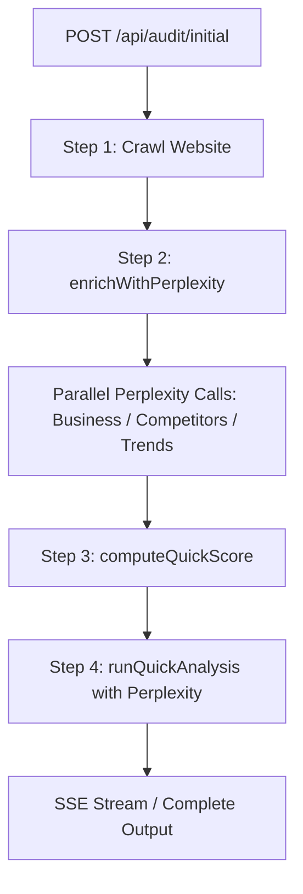
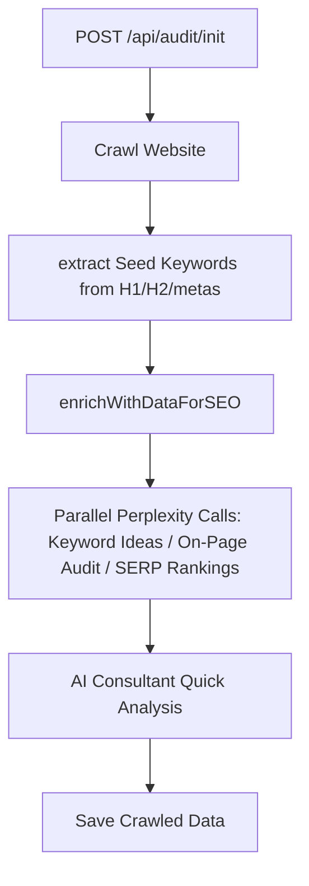

# Perplexity AI Web Research & Analysis Integration

This document outlines the architecture, workflows, exact prompts, and execution logic of the Perplexity AI integration used within the ClickTrends AI Audit application.

---

## 1. Introduction & Architecture Overview

The ClickTrends AI Audit application uses Perplexity AI models to perform real-time web searches, competitive intelligence, reputation lookup, keyword ideas generation, and SERP ranking verification. Perplexity is accessed via **OpenRouter** and uses `OPENROUTER_API_KEY`.

### Core API Configurations
*   **Base URL**: `https://openrouter.ai/api/v1`
*   **Flagship Model**: `perplexity/sonar-pro` (supports high-quality web-search and citations)
*   **Fallback Model**: `perplexity/sonar` (used dynamically if quota or rate limits [429 or 402] are hit on `sonar-pro`)
*   **Headers**:
    ```json
    {
      "Authorization": "Bearer <OPENROUTER_API_KEY>",
      "Content-Type": "application/json",
      "HTTP-Referer": "https://clicktrends.com.au",
      "X-Title": "ClickTrends AI Audit"
    }
    ```
*   **Temperature**: `0` (enforces deterministic responses)

---

## 2. Pipeline 1: The Initial Audit Pipeline (`/api/audit/initial`)

When a user requests a quick audit from the homepage, the server runs an asynchronous pipeline to crawl the site, gather intelligence, and generate instant feedback.



### Step 1: Crawler Execution
The crawler (`backend/services/crawler.js`) extracts on-page metadata, headings, CTAs, schema existence, content types, and social links from select pages of the target website.

### Step 2: Perplexity Intelligence Enrichment
At the end of the crawl, `enrichWithPerplexity` in `backend/services/perplexity.js` is executed to run three parallel web research tasks:

#### A. Business Overview Research (`researchBusinessOverview`)
*   **Objective**: Discover public information about the business (awards, reputation, reviews, size, and funding signals).
*   **System Prompt**:
    ```
    You are a business intelligence API. You MUST respond with ONLY a single raw JSON object. No preamble, no explanation, no markdown, no code blocks. Start your response with { and end with }. Never include text before or after the JSON.
    ```
*   **User Prompt**:
    ```
    Search the web for this Australian business and return a JSON summary.
    Domain: {cleanDomain}
    Industry: {industry}

    Search for: business description, reviews/ratings, news mentions, awards, size signals, social proof.

    Return ONLY this exact JSON structure (no other text):
    {"businessName":"string","description":"2-3 sentence factual description","offerings":["string"],"reputation":{"overallSentiment":"positive|neutral|mixed|negative|unknown","reviewSummary":"string","avgRating":"string or null","reviewPlatforms":["string"]},"newsAndMedia":["string"],"awards":["string"],"sizeSignals":"string","socialProof":["string"]}
    ```

#### B. Competitor Landscape Research (`researchCompetitors`)
*   **Objective**: Find the top 5-6 competitors targeting the same Australian audience and ranking for similar search intent.
*   **System Prompt**:
    ```
    You are a competitive intelligence API. You MUST respond with ONLY a single raw JSON object. No preamble, no explanation, no markdown, no code blocks. Start your response with { and end with }. Never include text before or after the JSON.
    ```
*   **User Prompt**:
    ```
    Search the web and find the top 5-6 competitors for this Australian {industry} business.
    Domain: {cleanDomain}
    {kwContext}

    Find businesses targeting the same Australian audience and ranking for the same keywords.

    Return ONLY this exact JSON structure (no other text):
    {"competitors":[{"name":"string","domain":"string","positioning":"string","strengths":["string"],"keyDifferentiator":"string"}],"marketContext":"string","competitiveGaps":["string"]}
    ```

#### C. Industry Trends Research (`researchIndustryTrends`)
*   **Objective**: Fetch 2024-2025 trends, regulatory updates, and consumer behavior shifts in the target industry.
*   **System Prompt**:
    ```
    You are a market research API. You MUST respond with ONLY a single raw JSON object. No preamble, no explanation, no markdown, no code blocks. Start your response with { and end with }. Never include text before or after the JSON.
    ```
*   **User Prompt**:
    ```
    Search for current trends in the Australian {industry} industry (2024-2025).

    Return ONLY this exact JSON structure (no other text):
    {"industryOutlook":"positive|neutral|challenging","keyTrends":[{"trend":"string","impact":"HIGH|MED|LOW","opportunity":"string"}],"regulatoryUpdates":["string"],"consumerShifts":["string"]}
    ```

### Step 3: Mathematical Scoring (`computeQuickScore`)
Before feeding the data to the final quick analysis LLM, the backend computes a mathematical health score (from 0 to 100) based on crawled metrics and Perplexity observations:

| Category | Max Points | Criteria / Rules |
| :--- | :--- | :--- |
| **On-Page SEO** | 35 pts | Meta descriptions (10 pts), Title tags (8 pts), H1 tags (8 pts), Image alt text coverage (9 pts) |
| **Technical SEO**| 25 pts | Structured Data presence (10 pts), Canonical tag coverage (8 pts), Crawl depth/internal links count (7 pts) |
| **Content & UX** | 20 pts | Social media links (8 pts: 2 pts per platform), CTA presence (6 pts), Content variety (6 pts: FAQ, blog, video) |
| **Reputation**   | 15 pts | Sentiment (10 pts: Positive = 10, Neutral = 6, Mixed = 4, Unknown = 3, Negative = 0), Awards count (5 pts) |
| **Competitive**  | 5 pts  | Gaps identified in Perplexity competitive research (5 pts) |

### Step 4: Quick Consultant Analysis (`runQuickAnalysis`)
Perplexity synthesizes all findings into a friendly, structured client report.
*   **System Prompt**:
    ```
    You are a senior digital marketing analyst conducting a rapid website audit.
    Analyze ONLY the data collected during the initial crawl and generate useful, engaging, business-focused insights.
    IMPORTANT RULES:
    1. Use only information available from the crawl. Do not invent findings.
    2. Do not make definitive claims. Use phrases such as "appears to", "may indicate", "potentially", "preliminary analysis suggests".
    3. Insights should feel like observations from an experienced consultant. Keep them concise and easy to scan.
    4. Prioritize business value over technical jargon.
    5. Return 10-20 high-quality preliminary insights that provide immediate value while users wait for the complete audit report.
    OUTPUT: Valid JSON only — no markdown, no explanation outside the JSON.
    ```
*   **User Prompt**:
    ```
    Website: {crawledData.url}
    Industry: {industry}
    Pages crawled: {crawledData.pages.length}
    Business name (from title): {businessName}
    Homepage title: {title}
    Homepage H1: {h1}
    Meta description: {metaDescription}
    Has schema markup: {hasSchemaMarkup}
    Missing meta descriptions: {missingMetas}/{totalPages} pages
    Missing H1 tags: {missingH1} pages
    Missing image alt text: {missingAlt} images
    Social links found: {socialLinksCount}
    CTAs found: {ctas}
    Sample headings: {headings}
    Content types: {contentTypes}
    Keywords found (Perplexity): {keywordCount}
    Top competitors (Perplexity): {topCompetitors}
    Business reputation: {overallSentiment}
    Market context: {marketContext}

    CRITICAL INSTRUCTION:
    The overall health score has been mathematically calculated as: {calculated.score}.
    You MUST return EXACTLY this number in the "score" field of your JSON.
    For the "insight" field, you may use or refine this mathematically-derived insight: "{calculated.insight}"

    Return this exact JSON structure:
    {
      "score": {calculated.score},
      "businessName": "<clean business name>",
      "insight": "<one punchy sentence summarising the site's biggest opportunity>",
      "businessInsights": ["insight 1", "insight 2"],
      "seoInsights": ["insight 1", "insight 2"],
      "contentInsights": ["insight 1", "insight 2"],
      "conversionInsights": ["insight 1", "insight 2"],
      "technicalInsights": ["insight 1", "insight 2"],
      "topOpportunities": ["opportunity 1", "opportunity 2"],
      "predictedEstimates": {
        "seoReadiness": "72-80",
        "contentQuality": "68-75",
        "technicalHealth": "80-88",
        "conversionReadiness": "65-78",
        "brandConsistency": "75-85"
      }
    }
    ```

---

## 3. Pipeline 2: Full / Deep Audit Pipeline (`/api/audit/init` & `analyze`)

For deep analysis, Perplexity replaces the external DataForSEO API entirely, handling keyword suggestions, page-specific audits, and SERP position checks.



### Seed Keyword Generation
The backend extracts seed keywords dynamically from:
1. Homepage H1 and H2 tags
2. Homepage meta descriptions
3. Crawled page titles (splitting off branding delimiters such as `-` or `|`)
Stop words are automatically stripped, and the top 5 distinct seed phrases are passed to Perplexity.

### Enrichment Steps (`backend/services/dataforseo.js`)

#### A. Keyword Ideas (`getKeywordIdeas`)
*   **Objective**: Search the web and suggest related high-intent keywords for the target market.
*   **System Prompt**:
    ```
    You are a keyword research API. Respond ONLY with a raw JSON array — no markdown, no prose, no code fences. Start with [ and end with ]. Never include any text before [ or after ].
    ```
*   **User Prompt**:
    ```
    Search the web and find the top {limit} SEO keywords related to these seed terms for an Australian business.
    Seed keywords: {seeds}
    Target market: Australia

    For each keyword provide realistic estimated values based on Australian search trends.
    Return ONLY a JSON array of up to {limit} objects with exactly this structure:
    [{"keyword":"string","searchVolume":number,"competition":"LOW|MEDIUM|HIGH","competitionIndex":number_0_to_1,"cpc":number_dollars,"keywordDifficulty":number_0_to_100,"trend":[number,number,number]}]

    Rules:
    - searchVolume: realistic Australian monthly searches (e.g. 50–50000)
    - competition: LOW/MEDIUM/HIGH string
    - competitionIndex: 0.0–1.0 decimal
    - cpc: Australian dollar CPC estimate
    - keywordDifficulty: 0–100 score
    - trend: last 3 months relative volumes as [number, number, number]
    ```

#### B. Page-Level Audit (`getOnPageAudit`)
*   **Objective**: Audit technical SEO parameters for the homepage.
*   **System Prompt**:
    ```
    You are an on-page SEO audit API. Respond ONLY with a raw JSON object — no markdown, no prose, no code fences. Start with { and end with }. Never include any text before { or after }.
    ```
*   **User Prompt**:
    ```
    Search the web and analyse the on-page SEO of this URL: {targetUrl}

    Research its title tags, meta descriptions, headings, content quality, internal linking, schema markup, page speed signals, and technical health.

    Return ONLY this exact JSON structure:
    {"url":"{targetUrl}","onPageScore":number_0_to_100,"title":"string","titleLength":number,"metaDescription":"string","metaDescLength":number,"canonical":"string_or_null","h1":["string"],"h2":["string"],"wordCount":number,"hasImages":true_or_false,"imagesCount":number,"imagesAltMissing":number,"internalLinksCount":number,"externalLinksCount":number,"brokenLinksCount":number,"checks":{"hasTitle":true_or_false,"hasMeta":true_or_false,"hasH1":true_or_false,"httpsEnabled":true_or_false,"isIndexable":true_or_false,"hasSchemaMarkup":true_or_false,"hasSitemap":true_or_false,"hasRobotsTxt":true_or_false,"noFlash":true_or_false,"noFrames":true_or_false,"has4xxErrors":true_or_false,"hasLargePage":true_or_false,"hasDuplicateTitle":true_or_false,"hasDuplicateMeta":true_or_false,"hasOrphanPage":true_or_false},"pageTiming":{"timeToFirstByte":number_ms_or_null,"domComplete":number_ms_or_null,"largestContentful":number_ms_or_null}}
    ```

#### C. SERP Rankings (`getSerpRankings`)
*   **Objective**: Query Google Australia to find search rankings (top 100) for the target domain under the discovered keywords.
*   **System Prompt**:
    ```
    You are a SERP research API. Respond ONLY with a raw JSON array — no markdown, no prose, no code fences. Start with [ and end with ]. Never include any text before [ or after ].
    ```
*   **User Prompt**:
    ```
    Search Google Australia and find where the domain "{cleanDomain}" ranks for these keywords:
    {keywordsList}

    For each keyword, find the position of {cleanDomain} in Google Australia organic results (top 100).
    If the domain does not appear in top 100, set position to null.

    Return ONLY a JSON array with exactly {keywordsCount} objects in the same order as the keywords:
    [{"keyword":"string","position":number_or_null,"url":"string_or_null","type":"organic|featured_snippet|null"}]
    ```

---

## 4. Error Handling & Local Fallbacks

To ensure robustness, if the OpenRouter Perplexity requests time out, run out of balance/quota, or fail parsing, the backend catches the error and generates **deterministic offline fallback mock data**.

### Fallback Data Generators

#### 1. Business Overview Fallback (`generateFallbackBusinessOverview`)
Creates standard metadata structures:
*   **Sentiment**: `unknown`
*   **Average Rating**: `4.2`
*   **Review Platforms**: `["Google Business Profile"]`
*   **Awards & Media**: `[]`

#### 2. Competitor Landscape Fallback (`generateFallbackCompetitors`)
If the industry is related to `marketing|seo|advertising|digital`, it returns predefined premium Australian competitors:
*   *Web Profits* (`webprofits.com.au`)
*   *Digital Next* (`digitalnext.com.au`)
*   *Online Marketing Gurus* (`onlinemarketinggurus.com.au`)
*   *Salience* (`salience.com.au`)
Otherwise, it defaults to generic service competitor patterns:
*   *Local [BizName] Co*
*   *Apex Solutions*
*   *Pinnacle Group*

#### 3. Industry Trends Fallback (`generateFallbackIndustryTrends`)
Populates generic 2024-2025 marketing/business trends:
*   *AI Adoption and Automation* (HIGH impact)
*   *Privacy and Consent Compliance* (HIGH impact)
*   *Hyper-personalisation* (MED impact)

#### 4. Keyword Ideas Fallback (`generateFallbackKeywords`)
Generates 25 realistic Australian-localized search terms based on seed combinations (e.g. prefixing "best", "top" and suffixing "melbourne", "agency", "company", "services", "australia"). Search volumes, CPC values (A$2.50 to A$14.50), and keyword difficulties (25 to 70) are procedurally estimated.

#### 5. On-Page Audit Fallback (`generateFallbackOnPageAudit`)
Generates standard technical benchmarks with an default score of `68` and maps current crawled page and image alt metadata into the result.

#### 6. SERP Rankings Fallback (`generateFallbackSerpRankings`)
Assigns mock organic/featured snippet positions (ranks 3 through 28) for 33% of the generated keywords, leaving others as `null` (not ranking in top 100).
